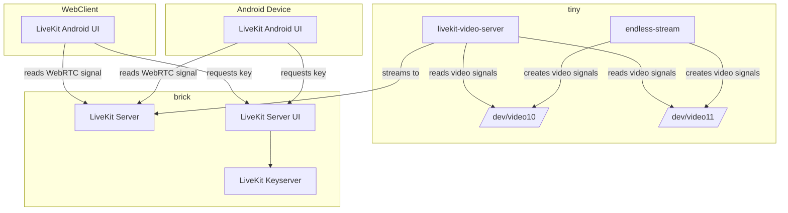
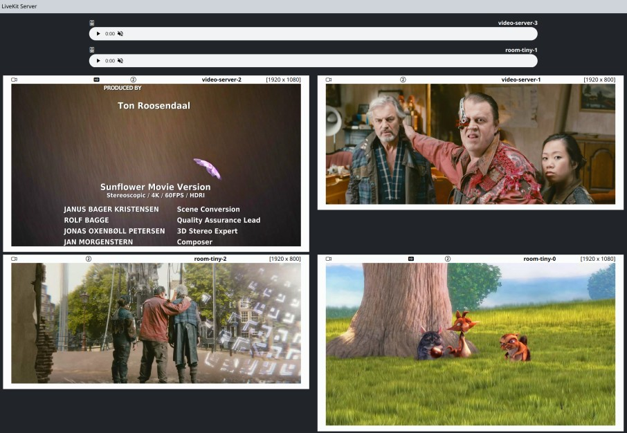
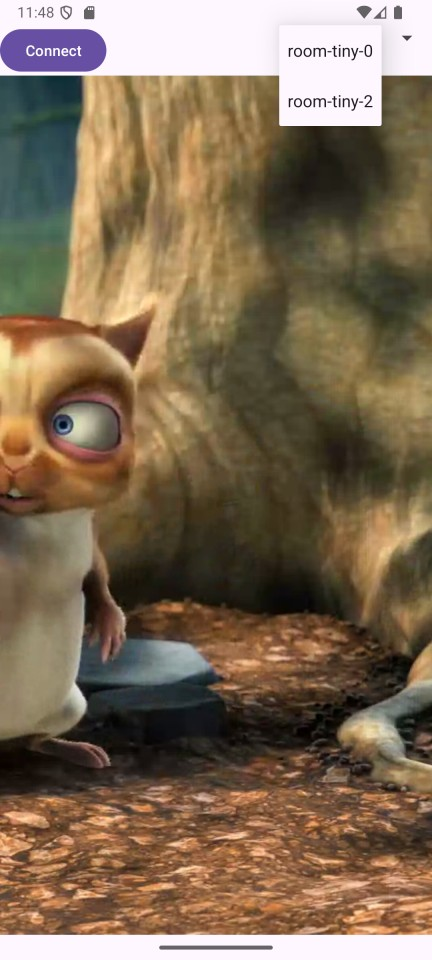

# LiveKit video-server

The goal of the project is to demonstrate how to build a video server using LiveKit. 
The server will be able to create rooms, publish and subscribe to tracks.

## Projects
This project is the video publisher and subscriber. It can be used to publish and subscribe to video and audio tracks.
It still needs a [LiveKit](https://livekit.io/) server instance to connect to.

The project consists of the following subprojects:
- [video-server-ui](https://github.com/maka00/livekit-video-ui)
- [livekit-keyserver](https://github.com/maka00/livekit-keyserver)
- [livekit-android-ui](https://github.com/maka00/livekit-android-ui)

For the cameras a v4l2-loopback device is used with a small C application writing two video files in an endless loop to 
the devices. For an python example to achieve this see: [endless-stream](https://github.com/maka00/gst-drm-output/tree/main/endless-stream)

## Architecture

The following is an architecture how the services are connected:

## Screenshots

The following screenshots show two instances of the livekit-video-server 
with two video sources and one audio source each in action:

The livekit-android-ui is a simple android app that can be used get the published video and audio tracks from the server.

## Configuration

The server can be configured using the following environment variables:

- TOKEN_SERVER: where to get the token from (simple rest call)
- LIVEKIT_SERVER: the LiveKit server to connect to with websocket protocol
- ROOM_ID: the room id to join/create
- CLIENT_ID: client id to use
- RECEIVER_VIDEO_ID: The video track id to subscribe to
- RECEIVER_AUDIO_ID: The audio track id to subscribe to
- PIPELINES: the number of pipelines to use
- PIPELINE_1: the pipeline to use for the first track
- PIPELINE_N: the pipeline to use for the second track

The incoming tracks can be recorded or streamed to an output device (kmssink, fakesink, v4l2sink etc).

## Remarks

Although it is possible to use the go wrapper (go-gst) for gstreamer, I would not recommend it. For prototyping it is fine,
but for production use the C API since the compile times of go-gst are very high.